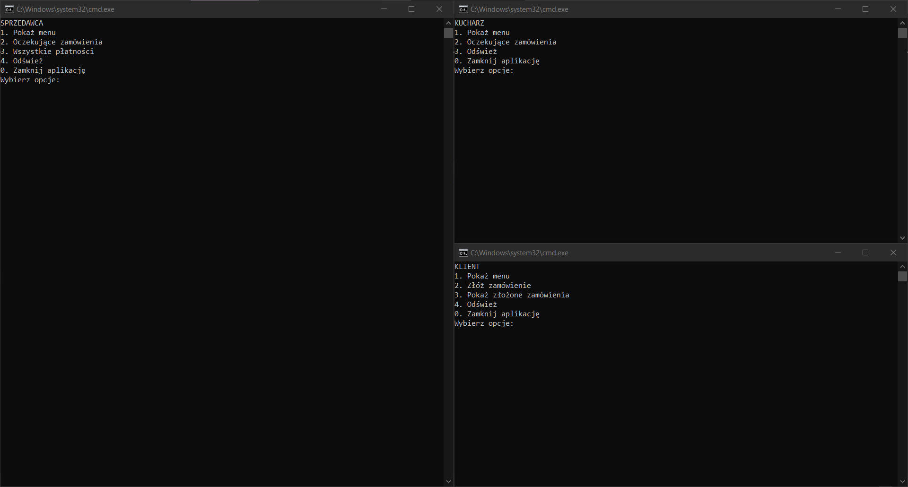

# Lab3-RestaurantSimulation
Project on laboratory Języki Programowania

Podczas laboratorium należy zbudować "mały system", pozwalający na interakcje z użytkownikami z poziomu konsoli, umożliwiający wykonywanie operacji CRUD (od ang. create, read, update and delete; pol. utwórz, odczytaj, aktualizuj i usuń) na przetwarzanych danych. Dane powinny być w jakiś sposób utrwalane (mogą być zapisywne w plikach). Wymagane jest, by logika biznesowa systemu była oddzielona od interfejsu użytkownika (by dało się bez problemu podmienić interfejs konsolowy na interfejs graficzny).

